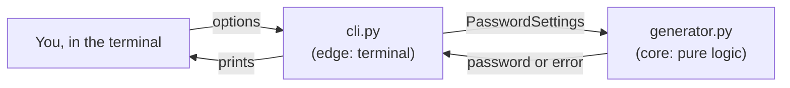

# Architecture

## The big idea
Two modules: one that makes passwords, one that talks to the terminal.

| Module | Job | Knows about |
|---|---|---|
| `generator.py` | Check the settings and create the password. No printing, no reading input. | nothing (only Python's `secrets` and `string`) |
| `cli.py` | Read the command-line options, call the generator, print the password or the error. | `generator.py` |
| `__main__.py` | Makes `python -m password_generator` start `cli.py`. | `cli.py` |

There is no `storage.py`. Nothing is saved (see [data-model.md](data-model.md)).

## Diagram


The arrows only point *into* `generator.py`, never out of it. That makes it easy to test: a test just calls a function and checks the result.

## How you use it
```text
python -m password_generator                          → 16 characters, all kinds
python -m password_generator --length 20              → 20 characters
python -m password_generator --no-symbols             → no symbols
python -m password_generator --length 12 --no-digits --no-symbols
```

Options: `--length N`, `--no-lowercase`, `--no-uppercase`, `--no-digits`, `--no-symbols`.

## What happens when …
… you run `python -m password_generator --length 20 --no-symbols`:

1. `__main__.py` starts `cli.py`.
2. `cli.py` reads the options with `argparse` (Python's built-in tool for command-line options). `--length 20` becomes the number `20`. Text like `abc` or `12.5` is rejected here.
3. `cli.py` builds `PasswordSettings(length=20, use_symbols=False)`. All other fields keep their defaults.
4. `cli.py` calls `generate_password(settings)` in `generator.py`.
5. `generator.py` checks the settings. If they break a rule (length outside 8–128, or all kinds off), it raises a `ValueError`, Python's standard "this value isn't allowed" error.
6. `generator.py` builds the password:
   1. pick one random character from each enabled kind (guarantees at least one of each)
   2. fill the rest with random characters from all enabled kinds together
   3. shuffle, so the guaranteed characters aren't always at the start
   All random choices use `secrets`.
7. `cli.py` prints the password, or, if there was a `ValueError`, prints the error message and exits with an error code.

## Project layout
```text
password_generator/
├── README.md
├── CLAUDE.md
├── pyproject.toml
├── .gitignore
├── docs/
├── password_generator/
│   ├── __init__.py
│   ├── __main__.py
│   ├── cli.py
│   └── generator.py
└── tests/
    ├── test_generator.py
    └── test_cli.py
```

## Deliberate choices (and what we're not doing)
- **Options on the command line, not an interactive menu.** One command gives one password, which matches the goal "one short command". Same approach as the expense tracker.
- **The rules live in `generator.py`, not in `cli.py`.** The core is correct on its own, no matter how it is called.
- **Tests check properties, not exact passwords.** The output is random, so tests check length, which characters appear, and that each enabled kind is present.
- **Not doing:** saving passwords, a config file for default settings, a clipboard, a graphical window.
