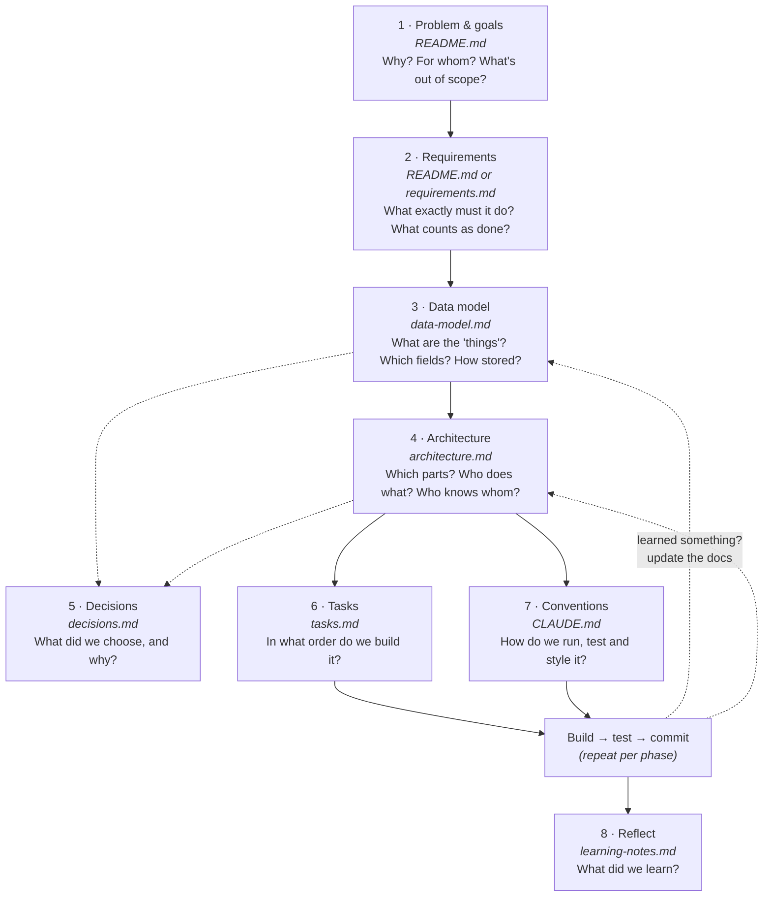

# How to Approach a Project

This file exists for me and for Claude Code in order to lead us to a structured approach to our projects. It is very important that we go step by step, write only the smallest document needed for the next decision so I can use it in my Obsidian vault.
A learning note on **what to think through before writing code**, in which order, and where to write it down, plus a recommended repository structure for small Python projects.

If a requirement or architecture changes, update the relevant doc and acceptance tests in the same commit.

Written after building the expense tracker. Examples refer to that project.


---


## The order of thinking

Each step builds on the one before. The arrows show that the order matters: you can't sketch the architecture until you know what data it moves around.



The dashed arrow from *Build* back to the docs is important. **The docs are living documents.** When building shows that the plan was wrong, fix the plan too, not just the code.

---

## Step by step

For each step: the **questions** to answer, a **template** to copy, when it's **good enough**, and the **expense tracker example**.

### 1. Problem & goals: `README.md`

The *why*. It's the first file anyone (including GitHub) shows, so keep it short.

**Questions**
- What problem does this solve, and for whom?
- What does success look like in one sentence?
- What is explicitly **not** part of this project? (Non-goals are as useful as goals, because they stop scope creep.)

**Template**
```markdown
# Project name
One-sentence description.

## Goals
- …

## Non-goals
- …

## Status
Planning / In progress / Done
```

**Good enough when:** a stranger can say in one sentence what the project is.

**Example:** *"A small CLI expense tracker. A learning project."* Non-goals were editing, multiple currencies and budgets.

### 2. Requirements: *what exactly* must it do?

Turn vague goals into concrete, **testable** statements. For small projects, this is a list in the README. For bigger ones, use a separate `requirements.md`.

**Questions**
- What can the user do? (Write these as *user stories*: "As a user, I can add an expense with an amount and category.")
- For each one: how do I know it works? (*Acceptance criteria*)
- What happens with **bad input** and **edge cases**? (empty list, zero, negative numbers, missing file…)

**Template**
```markdown
## Requirements
- [ ] Add an expense
  - amount must be > 0, max 2 decimals → otherwise a clear error
  - date defaults to today
- [ ] Show total
  - empty list → 0.00
```

**Good enough when:** every requirement could become a test.

**Example:** the edge cases in our tests (`"-5"`, `"1.234"`, an empty list, a damaged JSON file) are all requirements. We only wrote some of them down *before* coding. The ones we missed turned up while writing tests, and that's normal. Add them to the docs when you find them.

> 💡 Acceptance criteria become tests almost word for word. "Empty list → 0.00" is `assert total([]) == 0`.

### 3. Data model: `data-model.md`

The *nouns*. Decide this **before** the architecture, because every part of the program reads or writes this data.

**Questions**
- What are the "things" (entities)? For us, just one: `Expense`.
- What fields does each have? What type? Which are required, and what are the defaults?
- What are the validation rules?
- How is it identified? (an `id`?)
- How is it stored on disk? Show a **real example** of the file.
- What are the tricky representation choices? (money, dates, text case)

**Template**
````markdown
## <Entity>
| Field | Type | Example | Notes |
|---|---|---|---|

### Validation rules
- …

## Storage
Format, location, and an example file:
```json
…
```

## Edge cases
| Situation | Behaviour |
````

**Good enough when:** you could write the dataclass and a sample data file from the doc alone.

**Example:** the **integer cents** decision and the `{"expenses": [...]}` wrapper (which leaves room for more fields later) were both made here, before any code.

### 4. Architecture: `architecture.md`

The *verbs and boxes*: which parts exist, what each one is responsible for, and which part is allowed to use which.

**Questions**
- What are the main parts (modules)? Give each one **one job**.
- Which part talks to the outside world (user, files, network)? Keep those at the edges.
- Which direction do dependencies go? (Our logic module depends on nothing.)
- What happens, step by step, for one typical action? (Walking through one action in detail catches most design mistakes.)
- What are you deliberately **not** doing?

**Template**
````markdown
## The big idea
| Module | Job | Knows about |

## What happens when …
1. …

## Diagram
```mermaid
flowchart TD
  …
```

## Project layout
## Deliberate choices (and what we're not doing)
````

**Good enough when:** you know which file each task on your list goes in.

**Example:** `cli.py` → `expenses.py` / `storage.py`. The logic has no outgoing arrows, which is why 40+ of its tests needed no setup.

### 5. Decisions: `decisions.md`

A log of important choices, so you never have to wonder "why did we do it this way?" This is sometimes called an **ADR** (*Architecture Decision Record*). Keep it light.

**When to write one:** whenever you picked between real alternatives, and someone (future you) might reasonably question the choice.

**Template (one per decision)**
```markdown
## 2026-09-27 · Store money as integer cents
**Context:** floats are imprecise (0.1 + 0.2 ≠ 0.3).
**Options:** float · Decimal · integer cents
**Decision:** integer cents, converted only at input/output.
**Consequences:** simple and exact; must remember to convert for display.
```

**Example decisions from this project** (currently scattered across the other docs):
integer cents · JSON not SQLite · argparse subcommands not an interactive menu · standard library only · `expenses.json` in the current folder · pytest not unittest.

### 6. Tasks: `tasks.md`

The *order of work*. Only write this once the data model and architecture exist, because the tasks come from them.

**Principles**
- **Phases that each end with something runnable or testable.** Never "write all the code, then test."
- **Build from the inside out:** data model → logic → storage → user interface. Each layer can be tested before the next one depends on it.
- **Small, concrete items.** "`total(expenses) -> int`" is a task; "do calculations" isn't.
- **One phase ≈ one commit (or a few).**
- Keep a **stretch goals** section, so good ideas have somewhere to go without expanding the current scope.

**Good enough when:** you always know what the next single step is.

### 7. Conventions: `CLAUDE.md`

A file **Claude Code reads automatically at the start of every session**. It's the place for "how we work here", so you don't have to repeat it:

```markdown
# CLAUDE.md
- Run tests: `.venv/Scripts/python -m pytest`
- Run the app: `python -m expense_tracker <command>`
- Style: PEP 8, 4 spaces, docstrings on public functions
- expenses.py must not print or touch files (see architecture.md)
- This is a learning project: explain changes; don't commit unless asked
```

Running `/init` in Claude Code generates a first version from the code. Review and trim it, because a short file that's accurate beats a long one that's generic.

### 8. Reflect: `learning-notes.md`

After each phase or project: what went well, what surprised you, and which commands and concepts you want to remember. This is the doc that makes the *next* project faster.

---

## Scaling the process to the project size

| Project size | What to write |
|---|---|
| Tiny script (< 1 hour) | Nothing, or a comment at the top of the file |
| Small project (a weekend, like this one) | README (goals + requirements) · data-model · architecture · tasks |
| Medium project (weeks, several people) | All of the above + `decisions.md` + `CLAUDE.md` + a requirements doc |
| Anything with users or money | + security, backup and error-handling notes |

## Common mistakes

- **Starting with the UI.** The CLI (or the web page) is the part that changes most. Build it last, on top of tested logic.
- **Skipping non-goals.** Without them, "just one more feature" never stops.
- **Planning without examples.** "Stores expenses as JSON" is vague; a real example file isn't.
- **Letting docs go stale.** A wrong doc is worse than none. Update it in the same commit as the code change.
- **Over-planning.** If you're writing docs to avoid starting, start. The first phase will teach you more than another page.

---

## Recommended repository structure

### For a small Python project (recommended for your next one)

```text
my_project/
├── README.md               ← goals, requirements, usage (stays at the root: GitHub shows it)
├── CLAUDE.md               ← conventions for Claude Code (stays at the root: Claude reads it there)
├── pyproject.toml          ← project settings: name, Python version, pytest config
├── .gitignore
│
├── docs/                   ← all planning & learning docs (open this as your Obsidian vault)
│   ├── architecture.md
│   ├── data-model.md
│   ├── decisions.md
│   ├── tasks.md
│   └── notes/
│       ├── learning-notes.md
│       └── how-to-approach-a-project.md
│
├── my_project/             ← the Python package (underscores!)
│   ├── __init__.py
│   ├── __main__.py         ← enables `python -m my_project`
│   ├── cli.py              ← user interface (edge)
│   ├── <logic>.py          ← pure logic (core, no I/O)
│   └── storage.py          ← files / database (edge)
│
└── tests/                  ← mirrors the package: one test file per module
    ├── test_<logic>.py
    ├── test_storage.py
    └── test_cli.py
```

**Why each piece:**

| Piece | Reason |
|---|---|
| `docs/` folder | Keeps the root tidy. Code and docs don't mix. One folder to open in Obsidian. |
| README and CLAUDE.md at the root | Tools look for them there: GitHub for the README and Claude Code for CLAUDE.md. |
| `pyproject.toml` | The standard place for project settings. With pytest configured here, plain `pytest` works (no `python -m` needed). |
| `tests/` mirrors the package | You always know where the test for `storage.py` lives. |
| Core vs edges | Pure logic in the middle, I/O (terminal, files) at the edges, so the core is easy to test. |

A minimal `pyproject.toml`:

```toml
[project]
name = "expense-tracker"          # distribution name: hyphens are fine *here*
version = "0.1.0"
requires-python = ">=3.10"

[tool.pytest.ini_options]
testpaths = ["tests"]
pythonpath = ["."]                # lets plain `pytest` import the package
```

**Obsidian tip:** if you open the *whole repo* as a vault, Obsidian creates a `.obsidian/` settings folder there. Add `.obsidian/` to `.gitignore`. If you open only `docs/` as the vault, the code stays out of Obsidian entirely.

### The next level: `src/` layout (for later)

Bigger or published projects often put the package inside `src/`, as `src/my_project/`. This stops tests from accidentally importing your local folder instead of the installed package, but it requires installing the project (`pip install -e .`) before the tests can run. That's an extra concept to learn, so the flat layout above is the right choice while learning. Switch when you start packaging projects for others.

### This repo: current vs recommended

| Now | Recommended | Change needed |
|---|---|---|
| Docs at the root (`architecture.md`, …) | `docs/` folder | Move 5 files; update links in `README.md` |
| No `pyproject.toml` | Add one | New file; then `pytest` works without `python -m` |
| No `CLAUDE.md` | Add one | New file (`/init` or by hand) |
| Decisions spread across docs | `docs/decisions.md` | Collect the 6 decisions listed above |
| Package + tests | Already fine ✅ | – |
| `.gitignore` | Add `.obsidian/` | One line |

---

## Checklist for your next project

- [ ] README: one-sentence description, goals, **non-goals**
- [ ] Requirements with acceptance criteria and edge cases
- [ ] Data model with a **real example** of the stored data
- [ ] Architecture: modules with one job each, a diagram, and one action walked through step by step
- [ ] Decisions log started
- [ ] Tasks in phases, each ending in something runnable, built inside-out
- [ ] Repo skeleton: `pyproject.toml`, `.gitignore`, `CLAUDE.md`, `docs/`, package, `tests/`
- [ ] First commit, **then** start Phase 1
- [ ] After each phase: tests pass → update docs → commit
- [ ] At the end: write learning notes
